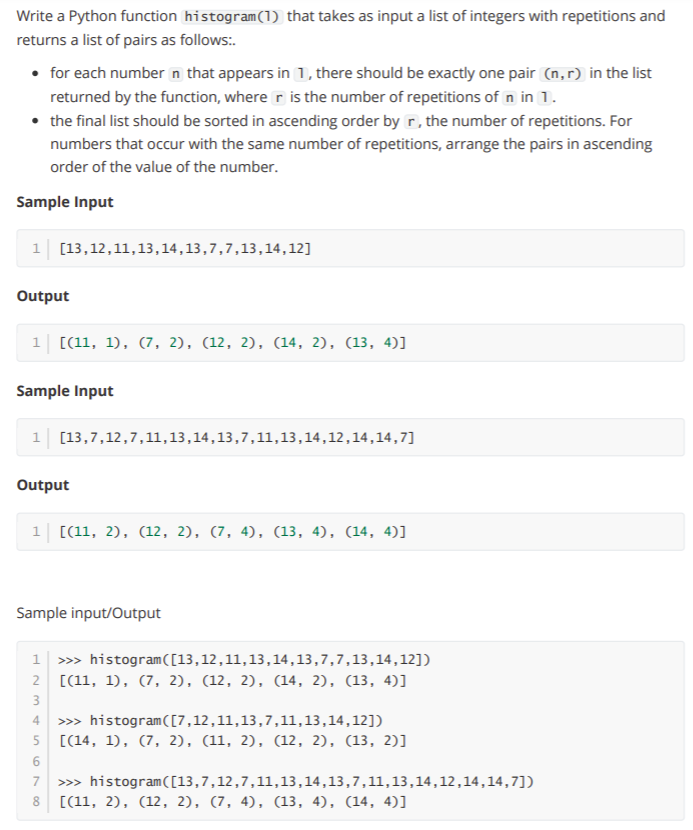

# Week 1

## Live Coding Problem 6

    # your code
    def count(L):
        freq = {}
        for i in L:
            if i in freq.keys():
                freq[i] +=1
            else:
                freq[i] = 1
        return freq, freq.keys()
    def histogram(L):
        freq, keys = count(L)
        nL = [(freq[i], i) for i in keys]
        nL.sort()
        finalL = [(t[1], t[0]) for t in nL]
        return finalL
    # your code
    # given evaluation code 
    L=eval(input())
    print(histogram(L))
